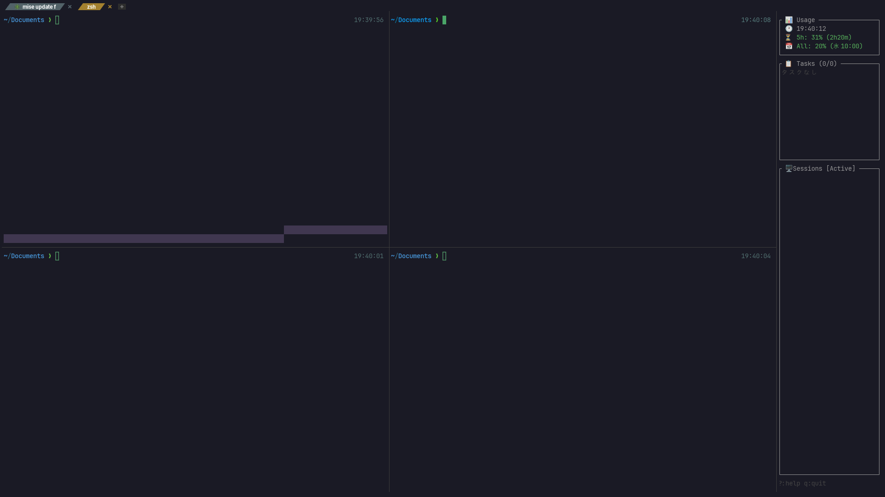
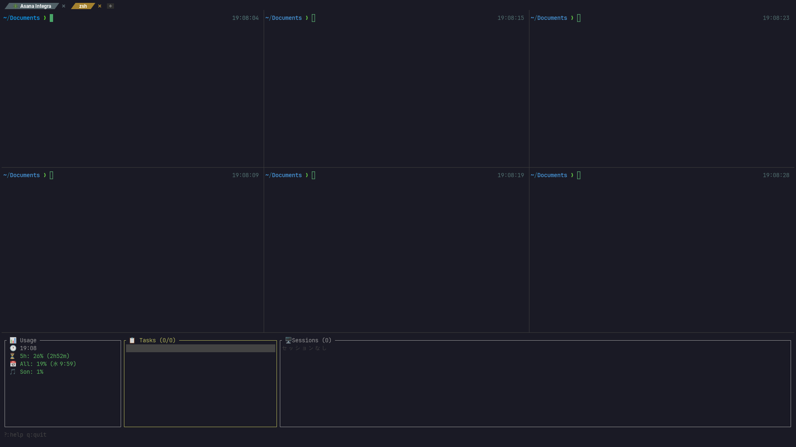
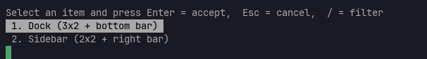
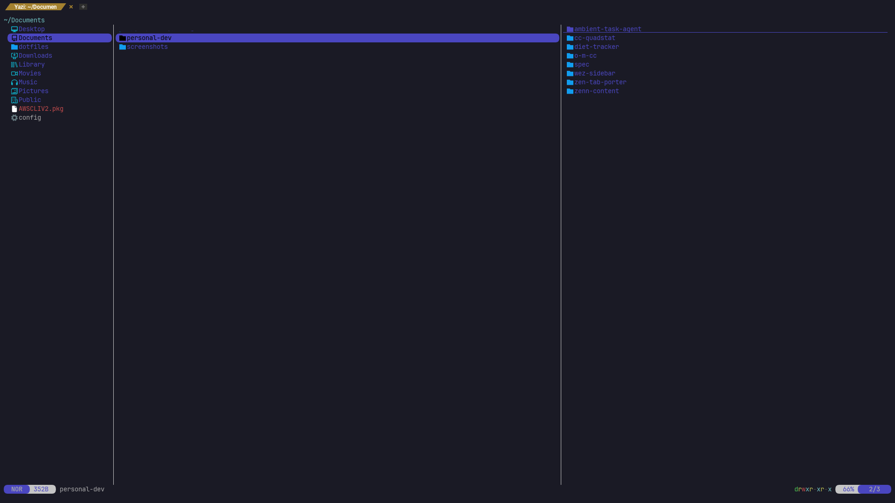

# wez-sidebar

[Claude Code](https://docs.anthropic.com/en/docs/claude-code) のセッション・使用量・タスクを監視する WezTerm サイドバー / ドック。

[English](README.md)

| Sidebar (MacBook) | Dock (外部モニター) |
|:---:|:---:|
|  |  |

| モード選択 | Overlay |
|:---:|:---:|
|  |  |

## 機能

- **セッション監視** - Claude Code セッションの状態（実行中 / 入力待ち / 停止）、稼働時間、タスク進捗をリアルタイム表示
- **yolo モード検出** - `--dangerously-skip-permissions` で起動したセッションをプロセスツリー遡行で自動検出
- **API 使用量** - Anthropic API の使用量（5時間制限・週間制限）をカラーコード付きで表示。hook 発火時に10分クールダウンで更新
- **タスク管理** - 内蔵 CLI（`wez-sidebar task add/done/list`）+ 外部連携用 JSON ファイル
- **内蔵 hook ハンドラー** - `sessions.json` を自律管理。外部依存なしで動作
- **2つの表示モード** - Sidebar（MacBook 向け右バー）または Dock（外部モニター向け下部バー）
- **ペイン連携** - Enter キーまたは数字キーで対象セッションの WezTerm ペインに即切り替え
- **デスクトップ通知** - permission prompt 時に macOS 通知（`terminal-notifier` 使用）

## 必要環境

- [WezTerm](https://wezfurlong.org/wezterm/)
- [Claude Code](https://docs.anthropic.com/en/docs/claude-code)
- Rust ツールチェーン（ビルド用）

## インストール

### バイナリ（Rust 不要）

```bash
# macOS (Apple Silicon)
curl -L https://github.com/kok1eee/wez-sidebar/releases/latest/download/wez-sidebar-aarch64-apple-darwin \
  -o ~/.local/bin/wez-sidebar && chmod +x ~/.local/bin/wez-sidebar

# macOS (Intel)
curl -L https://github.com/kok1eee/wez-sidebar/releases/latest/download/wez-sidebar-x86_64-apple-darwin \
  -o ~/.local/bin/wez-sidebar && chmod +x ~/.local/bin/wez-sidebar

# Linux (x86_64)
curl -L https://github.com/kok1eee/wez-sidebar/releases/latest/download/wez-sidebar-x86_64-linux \
  -o ~/.local/bin/wez-sidebar && chmod +x ~/.local/bin/wez-sidebar
```

### Cargo

```bash
cargo install wez-sidebar
```

### ソースから

```bash
git clone https://github.com/kok1eee/wez-sidebar.git
cd wez-sidebar
cargo install --path .
```

## クイックスタート

セットアップウィザードを実行:

```bash
wez-sidebar init
```

以下を対話的にセットアップ:
1. Claude Code hooks を `~/.claude/settings.json` に登録
2. タスク管理のセットアップ（オプション）
3. WezTerm キーバインドの案内

### 手動セットアップ

<details>
<summary>手動で設定する場合</summary>

#### 1. Hook の登録

`~/.claude/settings.json` に以下を追加:

```json
{
  "hooks": {
    "PreToolUse": [
      { "type": "command", "command": "~/.cargo/bin/wez-sidebar hook PreToolUse" }
    ],
    "PostToolUse": [
      { "type": "command", "command": "~/.cargo/bin/wez-sidebar hook PostToolUse" }
    ],
    "Notification": [
      { "type": "command", "command": "~/.cargo/bin/wez-sidebar hook Notification" }
    ],
    "Stop": [
      { "type": "command", "command": "~/.cargo/bin/wez-sidebar hook Stop" }
    ],
    "UserPromptSubmit": [
      { "type": "command", "command": "~/.cargo/bin/wez-sidebar hook UserPromptSubmit" }
    ]
  }
}
```

#### 2. WezTerm の設定

サイドバーを開くキーバインドを追加:

```lua
{
  key = "b",
  mods = "LEADER",
  action = wezterm.action_callback(function(window, pane)
    local tab = window:active_tab()
    tab:active_pane():split({ direction = "Right", args = { "wez-sidebar" } })
  end),
}
```

</details>

これだけで動く。設定ファイルは不要。

## セッションマーカー

| マーカー | 意味 |
|----------|------|
| 🟢 | 現在のペイン |
| 🔵 | 他のペイン |
| 🤖 | yolo モード（`--dangerously-skip-permissions`） |
| ⚫ | 切断済み |

| ステータス | 意味 |
|------------|------|
| ▶ | 実行中 |
| ? | 入力待ち（permission prompt） |
| ■ | 停止済み |

## タスク管理（オプション）

wez-sidebar にはシンプルなタスク CLI が内蔵されている。タスクは `~/.config/wez-sidebar/tasks.json` に保存される。

```bash
# タスク追加
wez-sidebar task add "認証機能を実装" -p 1 -d 2026-03-10

# タスク一覧
wez-sidebar task list

# タスク完了
wez-sidebar task done <id>
```

TUI パネルにタスクを表示するには、config で `tasks_file` を設定:

```toml
# ~/.config/wez-sidebar/config.toml
tasks_file = "~/.config/wez-sidebar/tasks.json"
```

ファイルの変更を file watcher でリアルタイムに反映。

外部ツール（Asana 同期スクリプト、GitHub Actions 等）から同じ JSON 形式で書き出すことも可能:

```json
{
  "tasks": [
    { "id": "1", "title": "タスク名", "status": "pending", "priority": 1, "due_on": "2026-03-10" }
  ]
}
```

## 設定項目

すべてオプション。カスタマイズが必要な場合のみ `~/.config/wez-sidebar/config.toml` を作成。

| キー | デフォルト | 説明 |
|------|-----------|------|
| `wezterm_path` | 自動検出 | WezTerm バイナリのフルパス |
| `stale_threshold_mins` | `30` | セッションを非アクティブと見なすまでの分数 |
| `data_dir` | `~/.config/wez-sidebar` | `sessions.json` / `usage-cache.json` の保存先 |
| `tasks_file` | *（なし）* | タスク JSON ファイルのパス（TUI タスクパネルを有効化） |
| `hook_command` | *（内蔵）* | hook 処理を委譲する外部コマンド |
| `api_url` | *（なし）* | タスク取得用 REST API の URL |

詳細は [`config.example.toml`](config.example.toml) を参照。

### Hook の外部委譲

デフォルトでは `wez-sidebar hook` がすべてを内部処理する。外部ツールに委譲する場合（セッション管理は維持しつつ）:

```toml
hook_command = "my-custom-tool hook"
```

wez-sidebar が `sessions.json` を更新した後、外部コマンドに hook ペイロードが stdin で転送される。

## 表示モード

### Sidebar（デフォルト）

```bash
wez-sidebar
```

### Dock（横長下部バー）

```bash
wez-sidebar dock
```

## キーバインド

| キー | Sidebar | Dock |
|------|---------|------|
| `j`/`k` | 上下移動 | 上下移動 |
| `Enter` | ペイン切り替え | ペイン切り替え |
| `t` | タスクモード | - |
| `Tab`/`h`/`l` | - | カラム移動 |
| `p` | プレビュー切替 | - |
| `f` | 全セッション表示切替 | 全セッション表示切替 |
| `d` | セッション削除 | セッション削除 |
| `r` | 全更新 | 全更新 |
| `?` | ヘルプ | ヘルプ |
| `q`/`Esc` | 終了 | 終了 |

## アーキテクチャ

```
Claude Code ──hook──→ wez-sidebar hook <event>
                              │
                        sessions.json（セッション状態）
                        usage-cache.json（API 使用量、10分クールダウン）
                              │
                        file watcher
                              │
                        wez-sidebar TUI
```

## ライセンス

MIT
